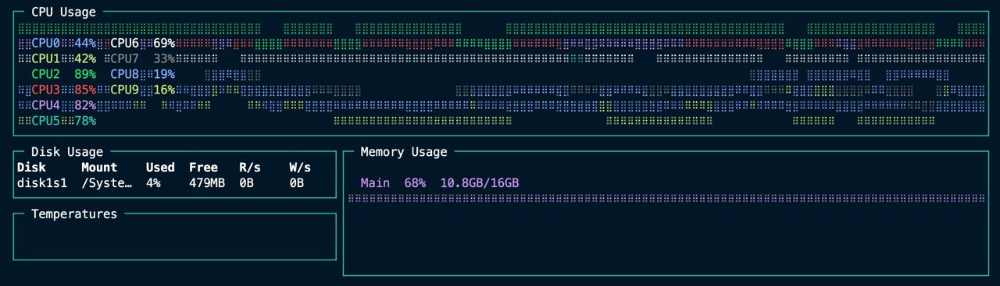
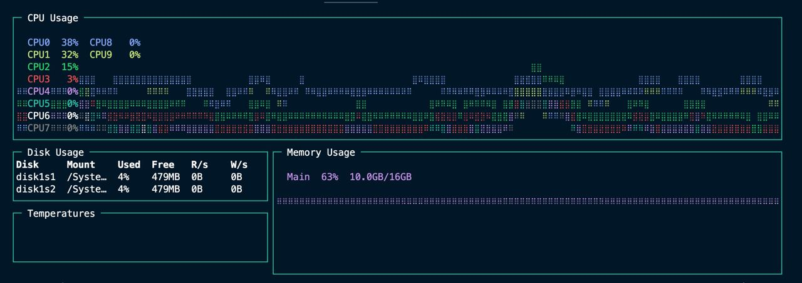
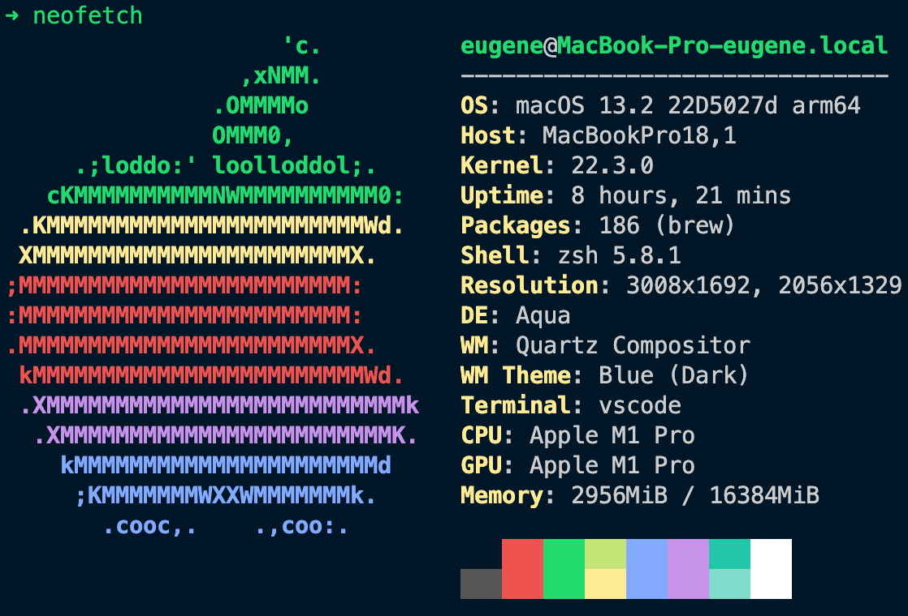

# Nestjs + Prisma databases benchmark

Проект для тестирования производительности баз данных, используемых в Nestjs + Prisma.
**Временно оставновил разработку, так как решил остановиться на Postgres из-за того, что он потребляет меньше всего ресурсов и позволяет более гибко хранить данные избегая дублирования**

Что используется в этом репо:

* NestJS `9.0.0`
* Prisma `4.7.1`
* Platform fastify  `9.2.1`
* PostgreSQL `15.1`
* MongoDB `6.0.1`

## Исследуемые кейсы и сценарии

Сравнение не реляционной и реляционной db (mongodb, postgres).

* [ ] Поиск
  * [ ] по нескольким значениям
  * [ ] по одному значению
  * [ ] по enum
  * [ ] полнотекстовый поиск
* [ ] Performance
  * [ ] Сравнение производительности
    * [ ] с использованием связей (1:1, 1:n, n:n)
    * [ ] без использования связей
  * [x] Замер производительности при
    * [x] записи всех данных в базу из kinopoiskdev api
    * [x] чтении
    * [x] удалении
* [ ] Влияние индексов на производительность
* [ ] Изучение запросов которые отправляет ORM в базу данных для
  * [ ] Mongo
  * [ ] Postgres

## Модель базы данных

### Postgres

Конфигурация кластера:

* Временно используется 1 экземпляр.

___

### Mongodb

Конфигурация кластера:  

* Config Server (3 member replica set): `configsvr01`, `configsvr02`, `configsvr03`
* 3 Shards (each a 3 member PSS replica set):
  * `shard01-a`, `shard01-b`, `shard01-c`
  * `shard02-a`, `shard02-b`, `shard02-c`
  * `shard03-a`, `shard03-b`, `shard03-c`
* 2 Routers (mongos): `router01`, `router02`

**Конфигурация была позаимствована из [этого репозитория](https://github.com/minhhungit/mongodb-cluster-docker-compose).**

## Тестирование

### Добавление персон в базу данных c использование метода upsert

Цель тестирования: сравнить производительность метода upsert в базах данных mongodb и postgresql при загрузке 5000000 персон с помощью метода upsert, по 100 персон синхронно и асинхронно. Метрикой измерения является время, потраченное на загрузку.

## Результаты тестирования

Это не все результаты, а всего лишь данные для показательности.

### mongodb
| Синхронное выполнение | Время (ms) | Асинхронное выполнение | Время (ms) | Batch | Время (ms) |
|--------|------------|--------|------------|--------|------------|
| 1      | 1645       | 1      | 492        | 1      | 4          |
| 2      | 1066       | 2      | 316        | 2      | 6          |
| 3      | 1446       | 3      | 247        | 3      | 5          |
| 4      | 1514       | 4      | 248        | 4      | 3          |
| 5      | 1278       | 5      | 245        | 5      | 6          |
| 6      | 1254       | 6      | 282        | 6      | 3          |
| 7      | 1320       | 7      | 306        | 7      | 3          |
| 8      | 1261       | 8      | 250        | 8      | 2          |
| 9      | 1351       | 9      | 199        | 9      | 2          |
| 10     | 1345       | 10     | 238        | 10     | 2          |
|Среднее время| 1308 ms|Среднее время| 275 ms|Среднее время| 3 ms|

### postgresql
| Синхронная запись | Время (ms) | Асинхронная запись | Время (ms) | Batch | Время (ms) |
|--------|------------|--------|------------|--------|------------|
| 1      | 4244       | 1      | 50         | 1      | 11         |
| 2      | 4577       | 2      | 32         | 2      | 2          |
| 3      | 6429       | 3      | 29         | 3      | 3          |
| 4      | 6735       | 4      | 33         | 4      | 4          |
| 5      | 6570       | 5      | 42         | 5      | 5          |
| 6      | 5563       | 6      | 41         | 6      | 3          |
| 7      | 5007       | 7      | 47         | 7      | 2          |
| 8      | 4685       | 8      | 30         | 8      | 2          |
| 9      | 4613       | 9      | 37         | 9      | 3          |
| 10     | 5174       | 10     | 40         | 10     | 4          |
|Среднее время| 5473 ms|Среднее время| 41 ms|Среднее время| 4 ms|

По результатам тестирования можно сделать следующие выводы:

* Метод upsert с синхронной записью в базе данных mongodb работает быстрее, чем в базе данных postgresql. Среднее время загрузки в mongodb составило *1308* мс, в то время как в postgresql - *5473* мс.
* А postgres выигрывает в асинхронной записи по времени, но это обманчиво, так как постгрес быстро отваливается из-за превышения коннектов, а в тоже время монга продолжает работать.  
* Batch upsert использует транзакции и методы deleteMany и createMany, обе базы показывают себя хорошо. Увеличение загружаемых персон до 1000 не приводит к сильному росту времени выполнения, а вот 10000 уже в обеих базах работает около 40-50 мс, но с с такой нагрузкой падает стабильность и потребление ресурсов растет. 

В целом, стандартный метод upsert в базе данных mongodb оказался более производительным и стабильными, чем в postgresql. Однако, стоит учитывать, что результаты тестирования могут быть субъективны.
А самописный batch upsert оказался максимально производительным в обеих базах, но по потреблению ресурсов тут postgres был явным лидером.

Так же стоит отметить, что postgres оказался менее устойчивым к нагрузкам. Увеличение количества данных приводило к падению базы. В mongodb это происходило только после нескольких часов такой нагрузки, а postgres мог упасть уже спустя 5 минут. Но 100 персон оказались самым оптимальным значением и обе базы работали стабильно. Это происходило до тех пор пока не было сожрано почти 100% процессора.

## Потребление ресурсов базой без нагрузки
### mongodb
После загрузки 4млн персон сожрала максимум ресурсов CPU моего пк и перестала функционировать.

### postgresql
Смог сохранить все загружаемые в него персоны и остаться в рабочем состоянии. При этом потребление ресурсов не высокое.

В этом тесте явно побеждает postgres.
## Наблюдения

Prisma не умеет работать с mongodb без транзакций, из-за чего приходится использовать репликасет. Что как по мне является недостатком, так как в старой реализации API мне нужна консистентность данных и транзакции.  

Такой подход скорее подходит для проектов где используются связи, но в этом изначально было 0 связей, и более правильно наверное было бы проверить без транзакций.

## Железо
